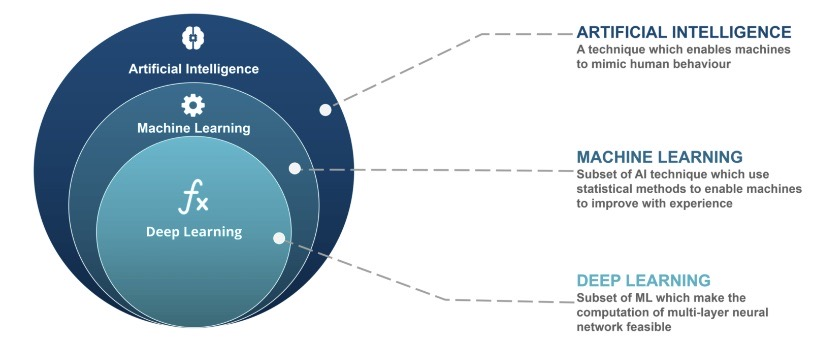
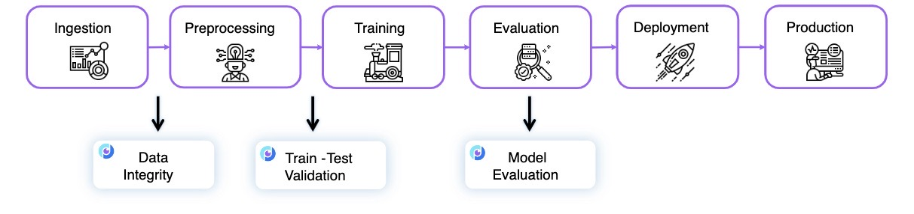
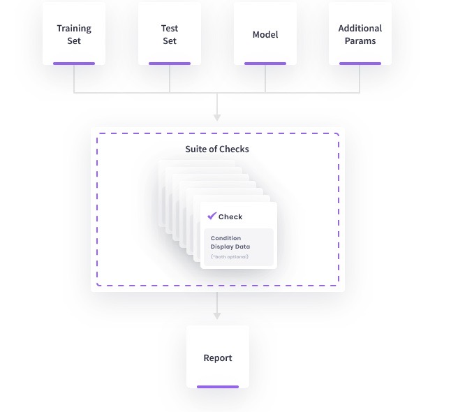

# Project

# Artificial Intelligence in Test Automation

What comes to mind when you hear the term "artificial intelligence" (AI)?
Perhaps sophisticated humanoid robots or sci-fi movie-era technologies come 
to mind. However, it turns out that this supposedly future technology is now
a part of our daily existence. It is present in our houses, televisions, and 
cell phones to make daily activities easier. In order to improve the efficiency
of your software testing efforts, AI can be incorporated. While "AI in testing" 
is a trendy term that might raise some doubt, it can actually add value and
streamline your testing processes.

Artificial intelligence is a system that can support human cognition and activities. 
It has increasingly self-learning capabilities. By comprehending the environment, resolving 
human issues, and carrying out human tasks, it achieves this.

## Categories of AI
In its simplest form, artificial intelligence combines computer science with big datasets 
to aid in problem-solving. The three main categories of AI are:

1- Artificial Narrow Intelligence, or ANI, is a subset of weak artificial intelligence that has been 
programmed to carry out particular tasks. Today, ANI dominates AI because of its focused emphasis on a 
single topic.

2- AGI (Artificial General Intelligence) is a type of powerful AI that is still considered 
hypothetical.Although AGI has not yet been developed, it is anticipated that it will be a computer with 
intelligence comparable to humans in terms of problem-solving, learning, and other areas.

3- "ASI" stands for "Artificial Super Intelligence." Only in sci-fi movies have we been able to catch a
peek of what such an AI may resemble. Another theorised AI at the moment is ASI. This kind of artificial 
intelligence would surpass human capacity and intelligence. 

## How AI Can Optimize Your Testing

The last couple decades have seen a fast evolution in software testing. Manual testing was the first step,
followed by early automation, agile testing, and finally continuous testing. It has now reached the testing 
phase for AI-augmented autonomy.

Although it may seem unachievable, you may begin integrating AI capabilities that will provide the groundwork 
for autonomous testing. By accelerating test creation, increasing test coverage, and lowering test maintenance,
AI can improve your testing.

Intelligent design uses object recognition to automatically identify new items and make modifications to the DOM.
Additionally, there is framework generation, which analyses your application automatically and suggests a test framework.

One form of intelligent test execution is business process automation, which aids in automating business activities
for end-to-end testing. The last type of intelligent test maintenance is self-healing, which automatically refreshes
your test suite as your application develops or progresses.

## The difference between AI, ML, and DL

Artificial intelligence: Ability of a machine to develop its own intelligence.

Machine learning: Ability of a machine to use algorithms by which it can automatically learn from data and experience.

Deep learning: Ability of a machine to learn via algorithms which mimic the human brain.

## AI in Automation Testing

Applications of AI in Intelligent Test Automation in General:

1- Tests create a tonne of data, which must be sorted through in order to extract meaning from AI analytics of test
automation data. This procedure' efficiency is significantly increased with the use of AI. Errors may be found and 
categorised using AI algorithms. False negatives and true positives in test cases can also be found using more advanced
AI algorithm applications. This can be extremely beneficial and significantly lessen the workload for QAs.

2- Self-healing tests: Conventional test automation tools specify the components of an application using specific IDs.
These elements are also subject to change if the programme is updated or altered in any manner. The tests that were working
well before the modification will now fail and produce a false negative result because of the fixed definitions that have 
been assigned to these items. Artificial intelligence algorithms are used in self-healing tests to automatically detect 
unanticipated problems caused by dynamic characteristics and suggest a better solution or automatically update the script.
This type of testing not only prevents tests from failing but also saves QAs time from having to search for and resolve issues.

3- Visual Locators: In AI-based user interface testing, visual locators may now locate components on a web application by vision,
even if their locators have been changed. As a result, there is no longer a requirement for hard coding using locators such 
accessibility IDs. Additionally, OCR and other image recognition methods may now be used by intelligent automation systems to 
visually map the programme, find visual regressions, or check items.

## The Evolution of AI
The potential applications of artificial intelligence are limitless, and each year, the usage of AI algorithms for intelligent 
test automation becomes more complex. Therefore, it is evident that there is significant potential for AI to alter the future 
of software testing, even though many AI test automation solutions are still in their infancy.

Users of BrowserStack may automate testing across more than 3000 different hardware, browser, and operating system combinations.
Users of Browserstack can run automated tests using a variety of languages and frameworks to test AI programmes like chatbots.

# Machine Learning in Test Automation

The discipline of data science, which is continually expanding, needs machine learning. In order to educate computers to provide categorization or 
predictions, statistical approaches are applied, providing crucial insights into data mining activities. Then, with the use of these insights, software 
and corporate decision-making are affected, hopefully affecting important growth indicators.Machine learning mimics human learning by using data and 
algorithms, gradually improving its accuracy.According to Forbes, organisations that have used machinelearning and AI-enabled technologies have seen 
dramatic rise in consumer satisfaction.

1- Writing test scripts with the necessary input values and running them to get the results involves using testing tools (like Selenium). The tool will handle the remainder of the testing process; the only manual work required is defining the test case as a computer script. 

2- Despite its advantages, test automation has a disadvantage in that it need continuous monitoring when testing software is updated. ML steps in to take control of this problem; 

3-It assists in automatically creating and updating test cases, identifying mistakes, and enhancing the current code scope. As a result, it helps businesses do more work of greater quality and quantity in less time.

Additionally, the use of machine learning in test automation makes it possible to run every change and input through QA. It would take a lot of time and 
money to accomplish this through manual testing or even test automation. Working on machine learning Without relying on an existing equation to serve as 
a model, machine learning employs computational techniques to learn information directly from data.

These are the three crucial elements of machine learning:

## A Decision Process
Ml algorithms are frequently employed in decision processes to provide
predictions or categorizations. The algorithms will estimate a trend in the data based on a
certain data input, which may or may not be indicated.

## Error Function 
An error function is used to examine the predictions made by the model. If known cases exist, an error function may compare them to assess how accurate the model is.

## Model optimization
If the model did well on the training data sets, weights are changed to reduce the gap between the model prediction and the outstanding example. The algorithm would automatically update settings as it continued to assess and optimise the process until a limit was reached.

# Automated Machine Learning
The way that organisations of all sizes see data science and machine learning has
significantly changed as a result of automated machine learning. Traditional machine
learning techniques take a lot of time, need a lot of resources, and are challenging to use in
practical situations. It calls for knowledge in a variety of areas, including that of data
scientists, who are currently among the most sought-after workers.
Automated machine learning modifies these processes by applying methodical techniques
to unprocessed data and selecting models that extract the most important knowledge from
huge data, sometimes known as &quot;the pattern in the noise.&quot; Top-ranked techniques are
included in automated machine learning to make data science more accessible to everyone.
The execution of test automation is crucial to its success. The ultimate objective is to
achieve faster releases at scale and quality. Find out how to make test automation faster,
more reliable, and more comprehensive.

# Three Ways Machine Learning Can Aid with Test Automation
For development teams, maintaining and extending test automation is a problem. On the
other side, development teams may use machine learning in order to create and run test
scripts. They are employed in the assessment phase following the post-execution test, which
entails examining data, trends, and business repercussions.
Understanding why ML should be used in automation testing is crucial before delving
further into how it may assist at each stage of the test automation process:

1- Aspects that are either modifiable by definition or modified by the developers
usually affect how well mobile and web applications test.

2- Testing stability may be jeopardised if changes are made to the data upon which the
test is based or, more frequently, if enhancements are made directly to the
application.

3- Non-ML testing scripts cannot instantly adapt to and deal with the changes indicated
above since they are static. This inability to adapt results in test errors, flaky/brittle
checks, build failures, unreliable test data, and other problems.
a few ways that machine learning might assist the development teams include:

1. Handle large amounts of test data: Organizations that use continuous testing
through Agile development run numerous test types every day. Units, API,
functionality, accessibility, integration, and other testing formats are all included in
this. These tasks are labor-intensive, manual, and frequently impossible to complete
without machine learning. The admins can efficiently slice and dice testing data,
identify trends and patterns, assess business dangers, and reach decisions more
quickly thanks to ML technology.

2. Make accurate quality assessments: With DevOps, development teams or groups
often provide customers with new products and value. Developers may benefit
greatly from knowing the level of quality, usability, and other aspects of code
reliability for each feature. Using ML may help teams become more mature and
deliver better code in less time. The machine learning model can evaluate security
issues, find test coverage gaps, and dynamically scan new scripts. For instance, a
code climate may look at all code alterations made in response to a pull request,
pinpoint any quality issues, and streamline the process. Additionally, a lot of DevOps
teams now employ the feature flags strategy to gradually reveal new features and to
hide them in the event of an issue. By automatically evaluating and contrasting
certain releases based on specified datasets and approval criteria, ML algorithms
may make such choices easier to reach.

3. Increase test validity Every time a new version of the application being tested is
delivered for review or new features are added, test engineers typically struggle to
maintain the scripts current in standard test automation tools.A test automation
system with self-healing and machine learning capabilities could be able to detect
changes made to a component locator automatically. Between established test
automation steps, a display was added, which either immediately fixed issues while
they were still happening or alerted developers and provided a prompt fix. With
these capabilities, test scripts used in CI/CD scheduling algorithms would function
considerably more efficiently and with less developer involvement.

Using Machine Learning in Test Automation
Testing tools are used in test automation to write test scripts with the required input
variables and execute them to get the desired results. The tool takes care of the rest of the
testing process; the only manual work necessary is to specify the test instance in the
manner of a computer script.
Test automation does have a drawback, though, in that it need constant monitoring
whenever testing software is changed. ML intervenes to deal with this situation.
Automatically creating and updating test cases, finding bugs, and expanding the scope of
the present code are all made easier by machine learning models. As a result, it helps firms
do more work of higher quality in a shorter amount of time.

# Machine Learning and Artificial Intelligence for Test Automation
Machine learning is creating a strong impact on software testing. The process of a software tester is either manual or automated. Manual testers find it difficult to work on the same process and review documents constantly. Many testers and QA teams are incorporating test automation in their companies. Machine learning is benefitting manual testers by simplifying their tasks. This helps companies produce higher quality and quantity of work in a shorter time.Hence, it is important for manual testers to learn automation testing. This method of testing helps save time and money. It also helps increase test coverage, improve the accuracy, and morale of the QA team. Through automation testing, developers and testers get the opportunity to work as a team. In short, automation does the job better than manual testing.However, there are certain things to consider in test automation while applying artificial intelligence (AI) and machine learning.

## 6 Things to Consider When Applying Machine Learning & AI in Test Automation
1. **UI Testing:** Visual testing is a quality assurance activity of software developers. They evaluate whether the application appears and performs the way it was intended for the end-user. It is important to know the kinds of patterns machine learning can recognize. Hence, a traditional machine vision system may require a serious inspection while reading complex surface textures and image quality. Therefore, A deep learning tool or system is, therefore, better suited for visual inspection of web or mobile applications. It provides rapid and accurate results.
2. **API Testing:** API testing is a type of software testing that enables communication and data exchange between two software systems.While testing at the API level, you need a higher degree of technical expertise and tools to get comprehensive test coverage.Therefore, it is important to consider whether testers have intimate knowledge of different application interfaces.Through AI, you can convert manual UI tests into automated API tests which take care of all the heavy lifting work
3. **Domain Knowledge:** Having domain expertise is crucial in software testing. Whether it is manual or automated testing, with artificial intelligence you can test the applications better. For example, writing test scripts in codes using Java, Python, C# can be challenging. In automated testing, advanced tools help testers develop codes and test scripts. With AI, machines can write flawless codes themselves
4. **Spidering AI:** The most popular approach to writing test scripts in test automation is done through spidering. It has a feature through which you can point at your web application using AI/ML tools. It then begins to crawl over the application automatically by scanning and collecting data.Over time, the tools build a dataset and create patterns for your application while running tests. The next time when you run this tool, it points out potential issues by taking references from its dataset containing patterns and behavior. However, keep in mind that some of the differences might not be valid. In this case, an expert with domain knowledge will have to confirm whether the issue flagged by ML is a bug or not. Spidering AI will be helpful in understanding which parts of an application should be tested. To put it simply, machine learning will carry out heavy tasks and a tester will have to validate the accuracy of the results.
5. **Test Script:** Software testers will find it difficult to determine the number of tests required when a code has been altered. The automated testing tools based on artificial intelligence predict whether an application requires multiple tests or not. 
There are two benefits of running tests using AI. You can stop running tests unnecessarily and save more time. It is convenient to analyze the overall performance of a system without repeating the test scripts. Hence, you do not have to monitor it every time manually.
6. **Robotic Test Automation:** Robotic process automation (RPA) refers to a software that performs repetitive business processes without any human interaction.It helps in automating existing interfaces in IT systems and maintains them completely. RPA scans the screen, navigates the systems, and later identifies and gathers data.The tasks are performed solely by the bots and the tests can be done using the web, desktop, or mobile applications. It helps set up test data and run regression tests. The main advantages of RPA are: scalability, codeless testing, cost savings, increased productivity, accurate results and flexibility
#### Final Words:
Almost half of the test procedures can be automated using artificial intelligence. Testers can make use of machine learning to teach systems to detect errors that may go undetected using manual testing. By using AI in your test automation, you can achieve accurate results in a shorter time. You can save time as AI takes care of most of the test process.However, you must understand the business process, test scenarios, test scripts, and how to run the tests using artificial intelligence.

# DeepChecks
DeepChecks is the leading tool for testing and for validating your machine learning models and data, and it enables doing so with minimal effort. Deepchecks accompanies you through various validation and testing needs such as verifying your data’s integrity, inspecting its distributions, validating data splits, evaluating your model and comparing between different models.

## When Should you use Deepchecks?
Deepchecks has many built-in checks and suites that can help validating various points throughout the research phase. Of course, every research process has its unique steps and challenges, and therefore all checks and suites can easily customized. Alongside that, we have identified that there are several recurring scenarios, that each have their own needs and characteristics.

## Which Type of Checks Exits?
They are checks for different phases in the ML workflow:
1. Data Integrity
2. Train-Test Validation (Distribution, Drift and Methodology Checks)
3. Model Performance Evaluation
## Checks:
Each check enables you to inspect a specific aspect of your data and models. They are the basic building block of the deepchecks package, covering all kinds of common issues, such as:
1. Weak Segments Performance
2. Train Test Feature Drift
3. Date Train Test Leakage Overlap
4. Conflicting Labels
Each check can have two types of results:

1. A visual result meant for display (e.g. a figure or a table).
2. A return value that can be used for validating the expected check results

## Hierarchy 

## How does it Work ? 
Deepchecks is built of checks, each designated to help to identify a specific issue. Some checks relate only to the data and labels and some require also the model. Suites are composed of checks. A Suite runs a collection of Checks with optional Conditions added to them. Each check contains outputs to display in a notebook and/or conditions with a pass/fail/warning output.
## What Do You Need in Order to Start?
Depending on your phase and what you wish to validate, you’ll need a subset of the following:
1. Raw data (before pre-processing such as OHE, string processing, etc.), with optional labels
2. The model’s training data with labels
3. Test data (which the model isn’t exposed to) with labels
4. A supported model that you wish to validate, including: scikit-learn, XGBoost, PyTorch, and more.

